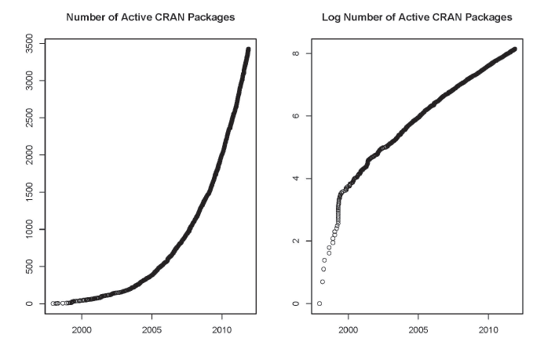
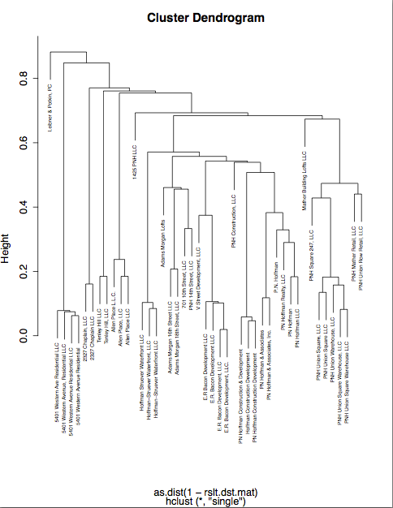
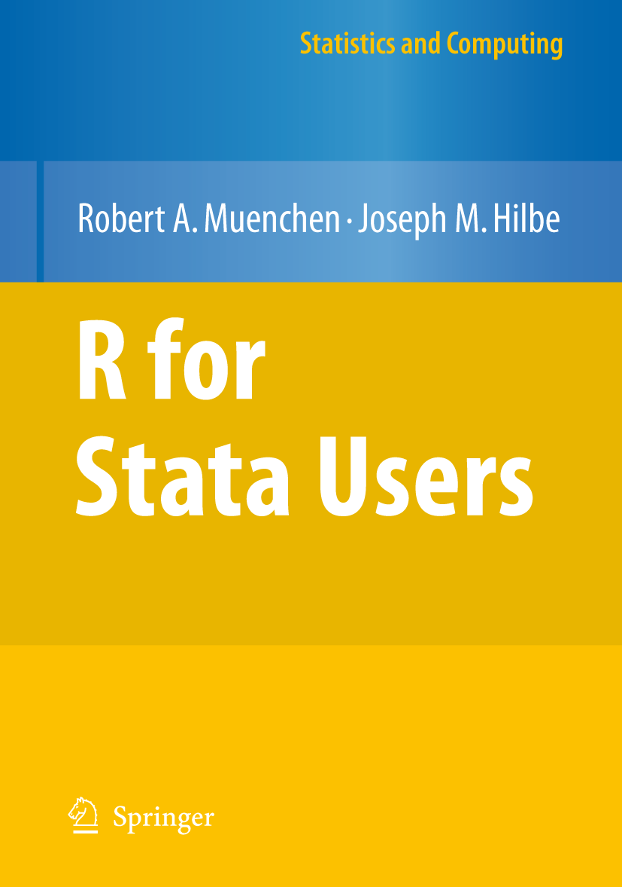

## History of R

<!-- nonvisible comment --> 

- 1980: Closed-source predecessor S came out of Bell Labs

- 1990’s: Development of open source implementation of S named “R”

- 2000: First production-ready release of R

- R is written in R itself, C, and Fortran

---

## Advantages of R 

- R excels at handling and analyzing non-rectangular data like geographic, network, webscraped, and xml data. Lists are natural containers for this data.

- R is very popular in statistics departments, and cutting-edge techniques often appear in R first. 
<!-- Now, this is distinct from being popular in econ departments. --> 

- R code is published with the [journal articles](http://public.econ.duke.edu/~ap172/ppw.R.txt)  [describing](http://www.economics.mcmaster.ca/faculty/racinej) the technique or as add-on packages.

---

## Advantages of R 

- Over 5,000 packages on the Comprehensive R Archive Network (CRAN),

- Exponential growth in number of packages over time. 
<!-- [Image from http://www.stat.tugraz.at/AJS/ausg121/121Hornik.pdf] --> 



---

## Advantages of R

- Excellent graphics


---


## Advantages of R (Graphics)


---

## Advantages of R (Graphics)


---

## Advantages of R (Graphics)



---


## Advantages of R (Graphics)


---

## Advantages of R (Graphics)


---

## Advantages of R (Graphics)


---

## Advantages of R (Graphics)

- The famous Facebook connections map: made with R


---


## Advantages of R (Graphics)

```{r setup, echo=FALSE, results='hide', message=FALSE, warning=FALSE}
## Isosurfaces of a brain With WebGL
## Splitting function courtesy of Duncan Murdoch
## Open in Safari - make sure Developer -> Enable WebGL clicked
## Should also open in Chrome (Firefox has initialization problem)
## Can comment out datadir/outdir 
## Clear the workspace - rm(list=ls())


### require(oro.nifti) # for reading
### require(rgl) # for rendering
### require(knitr)
### require(misc3d) # for contours
#################
## may need updated knitr for webgl hook
## use code below:
## require(devtools)
## install_github("knitr", username="yihui")
#################

library(knitr)

#hook_split_webgl <- function(before, options, envir) {
##   library(rgl)
  ## after a chunk has been evaluated
#  if (before || rgl.cur() == 0) return()  # no active device
#  name = tempfile('rgl', '.', '.html'); on.exit(unlink(name))
#  par3d(windowRect = 100 + options$dpi * c(0, 0, options$fig.width, options$fig.height))
#  Sys.sleep(.05) # need time to respond to window size change

#  writeLines(c('%WebGL%', '<script>webGLStart();</script>'), tpl <- tempfile())
#  warning("writing webGL to knitted doc")
#  writeWebGL_split(dir = dirname(name), filename = name, template = tpl)
#  res = readLines(name)
#  res = res[!grepl('^\\s*$', res)] # remove blank lines
#  paste(gsub('^\\s*<', '<', res), collapse = '\n') # no spaces before HTML tags
#}

### setting hooks and options - can change options obviously 
#knit_hooks$set(webgl = hook_split_webgl)
#opts_chunk$set(echo=FALSE, prompt=FALSE, messages=FALSE, warning=FALSE)
#knit_hooks$set(webgl = hook_webgl)


### writeWebGL_split - has add on for splitting triangles to maximum number of vertices
### use writeIt = FALSE for knitr - just splits up triangles
### source('writeWebGL_split.R', chdir = FALSE)
```


```{r makegll, webgl=TRUE,  warning=FALSE}
#require(ggplot2)
#qplot(wt, mpg, data = mtcars)
# results='hide',

# install.packages("alphashape3d")
# install.packages("rgl")
library("alphashape3d")
library("rgl")


grid.size <- 50

grid.mat<-expand.grid( sigma=seq(1, 10, length.out=grid.size),
          alpha=seq(0, 0.5, length.out=grid.size),
          L=10000,
          rho=0.95,
          a=seq(1, 1000, length.out=grid.size)
        )


condition.test <- function(x) {
  x["sigma"]/(1-x["alpha"]) - 1 < x["L"]/(x["rho"]*x["a"]) & 
    x["L"]/(x["rho"]*x["a"]) < x["sigma"] / x["alpha"] -1
}

condition.result<-apply(grid.mat, 1, condition.test)


grid.shape.mat<-grid.mat[condition.result, c("sigma", "alpha", "a")]

grid.f <-grid.shape.mat

x.max<-max(grid.f[, 1])
y.max<-max(grid.f[, 2])
z.max<-max(grid.f[, 3])

grid.f <- grid.f[order(grid.f[,1], grid.f[,2], grid.f[,3]), ]
for (i in 1:3) {
  grid.f[, i] <- grid.f[, i]/max(grid.f[, i])
}


grid.plot<-ashape3d(as.matrix(grid.f)[seq(1, nrow(grid.f), by=2), ], alpha=.1, pert = TRUE, eps = 1e-09)

open3d()
plot(grid.plot, col="blue")
rgl.viewpoint(270,20)


axis3d("x",  at = seq(0, 1, length.out=10), labels = signif(seq(0, x.max, length.out=10), 2 ), color="black")
axis3d("y",  at = seq(0, 1, length.out=10), labels = signif(seq(0, y.max, length.out=10), 2 ), color="black")
axis3d("z",  at = seq(0, 1, length.out=10), labels = signif(seq(0, z.max, length.out=10), 2), color="black")

title3d(xlab ="sigma", ylab = "alpha", zlab = "a", color="black") 


#source('/Users/travismcarthur/Downloads/RGL_Export-master-2/writeWebGL_split.R', chdir = FALSE)

#writeWebGL_split(dir=getwd(), filename ="knitted_webGL_first.html",  width=500)
# template = "/my_template.html",
# /Users/travismcarthur/Downloads/RGL_Export-master-2/
#rgl.quit()

# <object data="knitted_webGL_first.html" width="800" height="600"> <embed src="knitted_webGL_first.html" width="800" height="600"> </embed> Error: Embedded data could not be displayed. </object>

```


---


## Advantages of R 

- Large and rapidly growing user base

- Use of R on Kaggle, a platform for data prediction competitions:


<!-- [2011 data] --> 


---


## Advantages of R (vs. MATLAB)

- In R, you can name everything, so you access by name or position number.

- In MATLAB, you have to remember if $\gamma$ was the 3rd or 4th element in the vector, since you access stuff by position number.

- R was designed for statistics and has many more stats packages than MATLAB.

- MATLAB is geared toward engineering.

- In MATLAB, no natural way to set function argument defaults or allow an arbitrary number of arguments, whereas this is simple in R.

- In MATLAB, using functions within functions can tempt you to create global variables (this is bad).

- In R, the scoping rules allow you to easily pass arguments from the top-level functions to any function nested within it.

---

## Advantages of R (vs. Stata)

- Stata allows only one dataset at a time in the workspace

- It's often easier to write your own statistical routines or tweak existing ones in R than Stata.

---


## Drawbacks of R

- Small network in econ still. Stata is dominant. 

- Accuracy of add-on packages is verifiable but not necessarily verified.   Closed source is unverifiable but assumed to be verified. Note that commercial packages can also [get the wrong answer](http://politicalsciencereplication.wordpress.com/2013/09/11/guest-blog-how-to-persuade-journals-to-accept-your-replication-paper/). Also consider that no one trusted open source Linux initially and now about 70% of website servers worldwide use it.

<!-- [show lm - expose source] --> 

<!-- [if you want to modify a function, just expose the source, copy-paste to a script file and make your edits] --> 

<!-- [Evaluate reputation of package author, and note any tests. Does it do what it says it will do? Although sometimes the author was the person who developed the technique.] --> 

- Documentation is less detailed than commercial packages.

---

## Drawbacks of R, II

- The development of R is chaotic
 - Little central organization
 - Duplication of functionality (good illustration: [R-to-Latex coverage](http://conjugateprior.org/2013/03/r-to-latex-packages-coverage/))
 - Hard to kill outmoded ways of doing things because current code relies on it (backward compatibility)
 - On the bright side, the open nature of the R ecosystem encourages competition

---

## Drawbacks of R, III

- Need to learn a new language



- Stata-to-R help [here](http://dss.princeton.edu/training/RStata.pdf) and [here](https://patron.library.wisc.edu/authn/ezproxyiaa.html?url=http://library.books24x7.com/library.asp?%5EB&bookid=35268#default).
- MATLAB-to-R help [here](http://www.math.umaine.edu/~hiebeler/comp/matlabR.pdf).


---

## Drawbacks of R, IV

Sometimes “unexpected” behavior 

```{r chunkx, comment = NA, echo=TRUE}
1:length(c())
x <-1:8
x[x<5]<-1:2
x

```

[More](http://www.computerworld.com/s/article/9239757/Beginner_s_guide_to_R_Syntax_quirks_you_ll_want_to_know) [info](http://tim-smith.us/arrgh/) on [quirks](http://www.burns-stat.com/pages/Tutor/R_inferno.pdf)

---

## Finding & accessing packages

- [rseek.org](http://rseek.org/)

- [CRAN Taskviews](http://cran.r-project.org/web/views/)

```{r chunkx2, comment = NA, echo=TRUE}
#install.packages("quantreg")
library("quantreg")
```

Often it's not obvious how the different functions and object types within a package fit together, so look at the vignette if available.

<!-- http://spark.rstudio.com/nsturaro/pyramid0/ --> 


